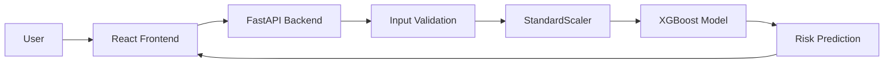
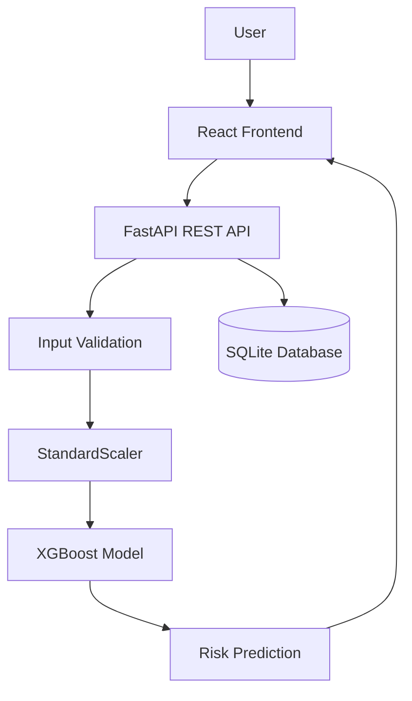

# 🫀 CardioGuard

### AI-Powered Cardiovascular Risk Assessment & Health Intelligence Platform

CardioGuard is an AI-powered web application designed to estimate cardiovascular disease risk using clinical health parameters and provide personalized, explainable health insights.

The platform combines **Machine Learning, risk prediction, What-If analysis, authentication, assessment history, and health insights** in a modern web interface.

---

## 🌐 Live Demo

[**Open CardioGuard**](https://nsnehalshah2-web.github.io/Cardioguard/)

---

## 🚀 Features

- 🩺 Cardiovascular Risk Prediction
- 🔬 What-If Risk Simulation
- 📊 Model Insights & Explainable AI
- 🔐 User Authentication & Password Reset
- 📋 Assessment History
- ⚠️ Input Validation
- 📱 Responsive Web Interface

---

## 🧠 System Workflow

## 🧠 Machine Learning Model

CardioGuard uses an XGBoost classifier with 9 clinical features:

- Age
- Sex
- Blood Pressure
- Cholesterol
- Fasting Blood Sugar
- Resting ECG
- Maximum Heart Rate
- Exercise-Induced Angina
- Oldpeak

## 🔗 System Architecture

## 👩‍💻 Author

- Nehal Shah
  
